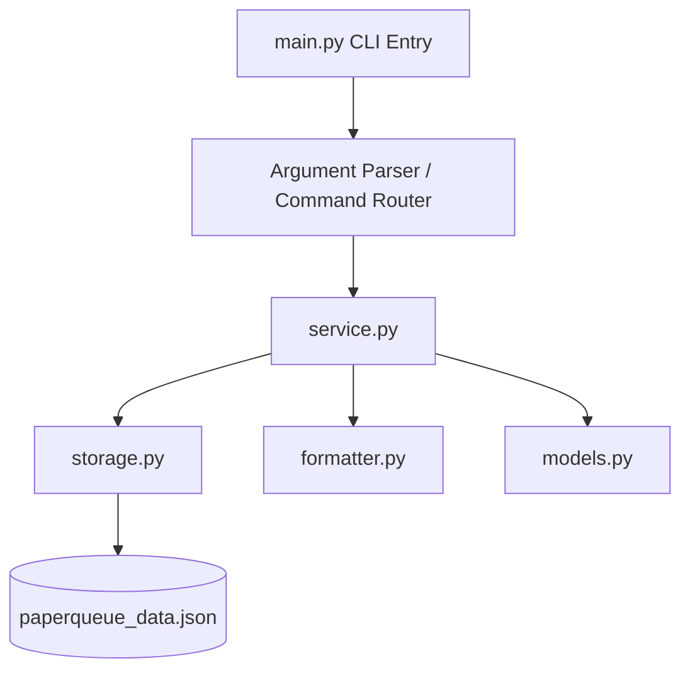
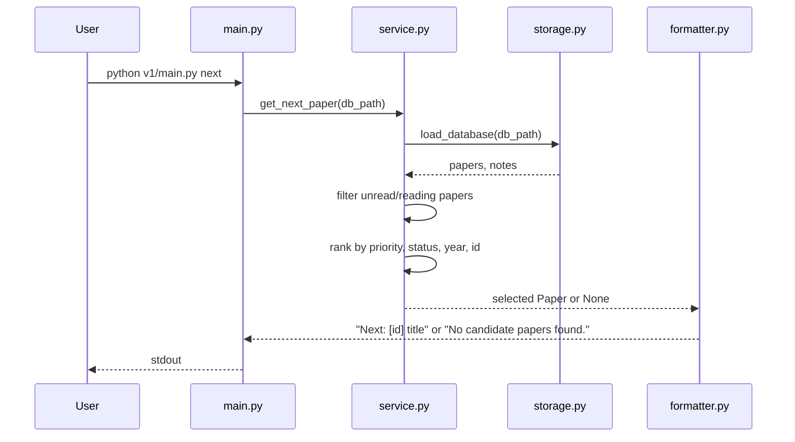

# PaperQueue CLI v1.0 SDD

本文件為 `PaperQueue CLI` 的 v1.0 Spec-Driven Development Document。此文件的目的是精確定義 CLI 契約、資料模型、模組邊界、錯誤處理與可執行測試案例，使他人或 AI 可直接依此完成實作，並作為後續 v2.0 向下相容的基準。

## 1. 專案概覽（Project Overview）

- 程式名稱：PaperQueue CLI
- 版本：v1.0
- 一句話描述（Elevator Pitch）：一個以命令列管理論文收藏、閱讀狀態、閱讀筆記與待讀優先順序的本地工具。
- 目標使用者：需要管理學術論文閱讀清單的學生、研究助理、研究生與個人學習者。
- 核心價值：
  - 以純 CLI 方式快速新增與查詢論文紀錄
  - 用固定資料模型管理閱讀狀態與閱讀筆記
  - 用簡單且可擴充的排序規則提供「下一篇建議閱讀」功能
  - 以穩定、可測試的輸出格式，作為 v2.0 升級時的相容性契約
  - 以薄 CLI + 可重用 service / storage 分層，為 v2.0 的資料庫或 UI 升級預留空間

## 2. CLI 介面規格（Interface Specification）

### 2.1 命令格式總覽

```text
python v1/main.py [--db PATH] <command> [command options]
```

### 2.2 全域規則

- `--db PATH`：
  - 型別：`str`
  - 必填：否
  - 預設值：`./paperqueue_data.json`
  - 說明：指定 JSON 儲存檔路徑。此旗標必須放在子命令前。
- 所有成功訊息輸出至 `stdout`，錯誤訊息輸出至 `stderr`。
- 所有 ID 皆為正整數，且由系統自動遞增產生。
- 時間欄位使用 ISO 8601 字串格式，例如：`2026-03-19T16:00:00`。
- `status` 允許值僅有：`unread`、`reading`、`read`。
- `priority` 允許值範圍為 `1` 到 `5`，數值越大代表越優先。
- `authors` 在 CLI 中以分號分隔輸入，例如：`"Alice Chen;Bob Lin"`。
- `tags` 在 CLI 中以逗號分隔輸入，例如：`"llm,systems,rag"`。
- `title`、`authors`、`note --text` 在去除前後空白後不得為空字串。
- `list --tag` 採精確字串比對，且在比對前會先去除查詢值前後空白。
- `list --sort` 僅允許值：`id`、`year`、`priority`、`title`；若傳入其他值，由 `argparse` 顯示 usage 與錯誤訊息並以退出碼 `2` 結束。
- 若 JSON 檔不存在：
  - `add` 會自動建立新檔
  - `list` 會輸出 `No papers found.`
  - `stats` 會輸出各統計值皆為 `0`
  - `show`、`update`、`note`、`delete` 會視為找不到指定論文
  - `next` 會輸出 `No candidate papers found.`

### 2.3 指令總覽

| 指令 | 說明 | 成功輸出前綴 |
|---|---|---|
| `add` | 新增論文紀錄 | `Added:` |
| `list` | 列出論文紀錄 | 無固定前綴，逐行輸出 |
| `show` | 顯示單篇論文詳細資訊 | `id:` |
| `update` | 更新既有論文欄位 | `Updated:` |
| `note` | 為指定論文新增筆記 | `Added note:` |
| `next` | 依既定規則推薦下一篇論文 | `Next:` |
| `delete` | 刪除指定論文與其筆記 | `Deleted:` |
| `stats` | 顯示資料總覽統計 | `total:` |

### 2.4 `add`

```text
python v1/main.py [--db PATH] add --title TEXT --authors TEXT [options]
```

| 參數 | 型別 | 必填 | 說明 | 範例 |
|---|---|---|---|---|
| `--title` | `str` | 是 | 論文標題 | `--title "Attention Is All You Need"` |
| `--authors` | `str` | 是 | 以分號分隔的作者清單 | `--authors "Ashish Vaswani;Noam Shazeer"` |
| `--year` | `int` | 否 | 發表年份 | `--year 2017` |
| `--venue` | `str` | 否 | 發表會議或期刊 | `--venue "NeurIPS"` |
| `--tags` | `str` | 否 | 以逗號分隔的標籤清單 | `--tags "transformer,nlp"` |
| `--url` | `str` | 否 | 論文連結 | `--url "https://arxiv.org/abs/1706.03762"` |
| `--pdf-path` | `str` | 否 | 本地 PDF 路徑 | `--pdf-path "./papers/attention.pdf"` |
| `--priority` | `int` | 否 | 閱讀優先級，預設為 `3` | `--priority 5` |

行為規格：

- 建立一筆新論文紀錄，系統自動分配新 `id`
- `status` 預設為 `unread`
- `title` 在去除前後空白後不得為空
- `authors` 會依分號切分，去除前後空白，且至少需保留一位作者
- `tags` 會去除前後空白，移除重複值並保留第一次出現順序
- 若指定的 `--db` 檔案不存在，系統必須自動建立

成功輸出：

```text
Added: [<id>] <title>
```

### 2.5 `list`

```text
python v1/main.py [--db PATH] list [options]
```

| 參數 | 型別 | 必填 | 說明 | 範例 |
|---|---|---|---|---|
| `--status` | `str` | 否 | 篩選指定狀態 | `--status unread` |
| `--tag` | `str` | 否 | 篩選包含指定 tag 的論文 | `--tag rag` |
| `--sort` | `str` | 否 | 排序欄位，允許值：`id`、`year`、`priority`、`title`；預設為 `id` | `--sort priority` |

行為規格：

- 列出所有符合篩選條件的論文，每篇一行
- `--status` 會先轉為小寫後驗證
- `--tag` 在比對前會先去除前後空白，並對 `Paper.tags` 做精確字串比對
- 若無符合資料，輸出 `No papers found.`
- 排序規則：
  - `id`：由小到大
  - `year`：由大到小，若年份缺失則排最後；同分時 `id` 小者在前
  - `priority`：由大到小；同分時 `id` 小者在前
  - `title`：不分大小寫字母排序；同分時 `id` 小者在前

單行輸出格式：

```text
[<id>] <status> | p=<priority> | <year-or-> | <title>
```

### 2.6 `show`

```text
python v1/main.py [--db PATH] show --id INT
```

| 參數 | 型別 | 必填 | 說明 | 範例 |
|---|---|---|---|---|
| `--id` | `int` | 是 | 指定論文 ID | `--id 3` |

行為規格：

- 顯示指定論文的完整資訊
- 若找不到指定 ID，輸出錯誤訊息並以退出碼 `1` 結束
- 輸出欄位順序固定，不得省略欄位
- 若可選欄位無值，輸出 `-`
- `authors` 以 `; ` 串接輸出，`tags` 以 `,` 串接輸出且不加空白

輸出格式：

```text
id: <id>
title: <title>
authors: <author1>; <author2>; ...
year: <year-or->
venue: <venue-or->
status: <status>
priority: <priority>
tags: <tag1,tag2,...-or->
url: <url-or->
pdf_path: <path-or->
notes: <note_count>
```

### 2.7 `update`

```text
python v1/main.py [--db PATH] update --id INT [options]
```

| 參數 | 型別 | 必填 | 說明 | 範例 |
|---|---|---|---|---|
| `--id` | `int` | 是 | 指定論文 ID | `--id 2` |
| `--title` | `str` | 否 | 更新標題 | `--title "New Title"` |
| `--authors` | `str` | 否 | 以分號分隔，完整覆蓋作者清單 | `--authors "Alice Chen;Bob Lin"` |
| `--year` | `int` | 否 | 更新年份 | `--year 2026` |
| `--venue` | `str` | 否 | 更新發表來源 | `--venue "ACL"` |
| `--tags` | `str` | 否 | 以逗號分隔，完整覆蓋 tags | `--tags "nlp,rag"` |
| `--url` | `str` | 否 | 更新連結 | `--url "https://example.org"` |
| `--pdf-path` | `str` | 否 | 更新 PDF 路徑 | `--pdf-path "./papers/a.pdf"` |
| `--status` | `str` | 否 | 更新狀態，允許值：`unread`、`reading`、`read` | `--status reading` |
| `--priority` | `int` | 否 | 更新閱讀優先級 | `--priority 4` |

行為規格：

- 至少必須提供一個實際要更新的欄位，否則視為無效輸入
- 若指定論文不存在，輸出錯誤訊息並以退出碼 `1` 結束
- `title`、`authors`、`status`、`priority` 的驗證規則與 `add` 相同
- `authors` 與 `tags` 會完整覆蓋舊值
- `venue`、`url`、`pdf_path` 若提供空字串，會被正規化為 `null`
- 更新成功時需同步更新 `updated_at`

成功輸出：

```text
Updated: [<id>]
```

### 2.8 `note`

```text
python v1/main.py [--db PATH] note --id INT --text TEXT
```

| 參數 | 型別 | 必填 | 說明 | 範例 |
|---|---|---|---|---|
| `--id` | `int` | 是 | 指定論文 ID | `--id 2` |
| `--text` | `str` | 是 | 閱讀筆記文字 | `--text "Focus on Section 3"` |

行為規格：

- 為指定論文建立一筆新筆記
- `--text` 在去除前後空白後不得為空
- 筆記需自動分配新 `note_id`
- 若指定論文不存在，輸出錯誤訊息並以退出碼 `1` 結束
- 新增筆記後需同步更新該論文的 `updated_at`

成功輸出：

```text
Added note: [<paper_id>]
```

### 2.9 `next`

```text
python v1/main.py [--db PATH] next
```

| 參數 | 型別 | 必填 | 說明 | 範例 |
|---|---|---|---|---|
| 無 | - | - | 推薦下一篇應閱讀的論文 | `python v1/main.py next` |

行為規格：

- 候選論文僅包含 `status` 為 `unread` 或 `reading` 的論文
- 若沒有任何候選論文，輸出 `No candidate papers found.`
- 候選排序規則固定如下：
  1. `priority` 高者優先
  2. `status=reading` 優先於 `status=unread`
  3. `year` 較新者優先，缺失年份排最後
  4. `id` 較小者優先

成功輸出：

```text
Next: [<id>] <title>
```

### 2.10 `delete`

```text
python v1/main.py [--db PATH] delete --id INT
```

| 參數 | 型別 | 必填 | 說明 | 範例 |
|---|---|---|---|---|
| `--id` | `int` | 是 | 指定論文 ID | `--id 7` |

行為規格：

- 刪除指定論文
- 同時刪除所有關聯筆記
- 若指定論文不存在，輸出錯誤訊息並以退出碼 `1` 結束

成功輸出：

```text
Deleted: [<id>] <title>
```

### 2.11 `stats`

```text
python v1/main.py [--db PATH] stats
```

| 參數 | 型別 | 必填 | 說明 | 範例 |
|---|---|---|---|---|
| 無 | - | - | 顯示資料總覽統計 | `python v1/main.py stats` |

行為規格：

- 統計目前資料庫中的總論文數、各狀態數與筆記總數
- 若資料檔不存在，視為空資料庫
- 輸出順序固定，不得改變

輸出格式：

```text
total: <paper_count>
unread: <count>
reading: <count>
read: <count>
notes: <note_count>
```

## 3. 資料模型（Data Model）

### 3.1 `Paper`

| 欄位 | 型別 | 說明 | 必填 |
|---|---|---|---|
| `id` | `int` | 論文唯一識別碼，自動遞增 | 是 |
| `title` | `str` | 論文標題 | 是 |
| `authors` | `list[str]` | 作者清單 | 是 |
| `year` | `int \| null` | 發表年份 | 否 |
| `venue` | `str \| null` | 會議或期刊名稱 | 否 |
| `tags` | `list[str]` | 論文標籤 | 是，預設空清單 |
| `url` | `str \| null` | 線上連結 | 否 |
| `pdf_path` | `str \| null` | 本地 PDF 路徑 | 否 |
| `status` | `str` | `unread`、`reading`、`read` 之一 | 是 |
| `priority` | `int` | 閱讀優先級，範圍 `1` 到 `5` | 是 |
| `created_at` | `str` | 建立時間，ISO 8601 字串 | 是 |
| `updated_at` | `str` | 最近更新時間，ISO 8601 字串 | 是 |

### 3.2 `Note`

| 欄位 | 型別 | 說明 | 必填 |
|---|---|---|---|
| `id` | `int` | 筆記唯一識別碼，自動遞增 | 是 |
| `paper_id` | `int` | 對應的論文 ID | 是 |
| `text` | `str` | 筆記內容 | 是 |
| `created_at` | `str` | 建立時間，ISO 8601 字串 | 是 |

### 3.3 JSON 儲存結構

預設儲存在 `./paperqueue_data.json`，結構如下：

```json
{
  "next_paper_id": 3,
  "next_note_id": 2,
  "papers": [
    {
      "id": 1,
      "title": "Spec-Driven Development for AI Systems",
      "authors": ["Alice Chen", "Bob Lin"],
      "year": 2024,
      "venue": "AIASE",
      "tags": ["sdd", "ai"],
      "url": "https://example.org/sdd",
      "pdf_path": null,
      "status": "reading",
      "priority": 4,
      "created_at": "2026-03-19T16:00:00",
      "updated_at": "2026-03-19T16:05:00"
    }
  ],
  "notes": [
    {
      "id": 1,
      "paper_id": 1,
      "text": "Focus on backward compatibility section.",
      "created_at": "2026-03-19T16:05:00"
    }
  ]
}
```

資料一致性規則：

- `next_paper_id` 與 `next_note_id` 必須始終大於目前資料集中最大 ID
- `notes.paper_id` 必須指向存在中的 `papers.id`
- 儲存時若 `next_paper_id` 或 `next_note_id` 小於目前最大 ID + 1，系統必須自動修正為合法值
- 刪除論文時，所有 `paper_id` 對應到該論文的筆記也必須同步刪除

## 4. 模組架構（Module Design）

### 4.1 實際模組拆分

| 模組 | 主要責任 |
|---|---|
| `main.py` | CLI entry point，解析命令列參數並 dispatch 到 service |
| `models.py` | 定義 `Paper`、`Note`、共享常數與自訂錯誤類型 |
| `storage.py` | 負責 JSON 檔案讀寫、初始化空資料、儲存一致性 |
| `service.py` | 實作新增、查詢、更新、刪除、統計、推薦等核心邏輯 |
| `formatter.py` | 將 service 回傳的資料格式化為固定 stdout 文字 |
| `requirements.txt` | v1 依賴列表；本版本無第三方套件需求 |

### 4.2 架構圖



### 4.3 `next` 指令流程圖



### 4.4 設計原則

- CLI 層只負責參數解析，不直接處理 JSON 細節
- 核心邏輯集中在 `service.py`，方便 v2.0 改成 SQLite 或新增 TUI 時重用
- 輸出格式集中在 `formatter.py`，避免 v2.0 升級時誤改既有 stdout 契約
- JSON 結構已獨立出 `papers` 與 `notes`，便於未來對映到多張資料表
- `models.py` 中的自訂錯誤將使用者輸入錯誤、找不到資料與儲存層錯誤分開，便於 v2.0 保留相同退出碼契約

## 5. 錯誤處理規格（Error Handling）

| 情境 | 預期行為 | 退出碼 |
|---|---|---|
| 找不到指定論文 ID | 輸出 `Error: paper not found: <id>` | `1` |
| `update` 未提供任何可更新欄位 | 輸出 `Error: no fields to update` | `2` |
| `status` 不在允許值內 | 輸出 `Error: invalid status: <value>` | `2` |
| `priority` 不在 `1..5` 範圍內 | 輸出 `Error: invalid priority: <value>` | `2` |
| `add` 或 `update` 的 `title` 為空字串 | 輸出 `Error: title must not be empty` | `2` |
| `add` 或 `update` 的 `authors` 解析後為空 | 輸出 `Error: authors must not be empty` | `2` |
| `note --text` 為空字串 | 輸出 `Error: note text must not be empty` | `2` |
| 無效子命令、缺少必要參數或 `--sort` 非法 | 顯示 `argparse` usage 與錯誤訊息 | `2` |
| JSON 檔存在但格式損毀 | 輸出 `Error: failed to read database` | `3` |
| JSON 檔無法寫入 | 輸出 `Error: failed to write database` | `3` |

補充規則：

- 成功執行一律返回退出碼 `0`
- `list`、`next`、`stats` 在空資料狀態下不視為錯誤，仍返回退出碼 `0`

## 6. 測試案例（Test Cases）

以下測試案例以同一工作目錄依序執行，並共用同一資料檔 `./tmp_sdd_v1_demo.json`。執行案例 1 前，該檔案必須不存在。

| # | 輸入指令 | 預期輸出 | 通過條件 |
|---|---|---|---|
| 1 | `python v1/main.py --db ./tmp_sdd_v1_demo.json add --title "Spec-Driven Development for AI Systems" --authors "Alice Chen;Bob Lin" --year 2024 --venue "AIASE" --tags "sdd,ai" --url "https://example.org/sdd" --priority 5` | `Added: [1] Spec-Driven Development for AI Systems` | `stdout` 完全相同，退出碼 `0` |
| 2 | `python v1/main.py --db ./tmp_sdd_v1_demo.json add --title "Retrieval-Augmented Generation in Practice" --authors "Carol Wu" --year 2023 --venue "NLPConf" --tags "rag,nlp" --priority 3` | `Added: [2] Retrieval-Augmented Generation in Practice` | `stdout` 完全相同，退出碼 `0` |
| 3 | `python v1/main.py --db ./tmp_sdd_v1_demo.json list --sort priority` | ```[1] unread | p=5 | 2024 | Spec-Driven Development for AI Systems\n[2] unread | p=3 | 2023 | Retrieval-Augmented Generation in Practice``` | `stdout` 逐字相同且行序一致，退出碼 `0` |
| 4 | `python v1/main.py --db ./tmp_sdd_v1_demo.json show --id 1` | ```id: 1\ntitle: Spec-Driven Development for AI Systems\nauthors: Alice Chen; Bob Lin\nyear: 2024\nvenue: AIASE\nstatus: unread\npriority: 5\ntags: sdd,ai\nurl: https://example.org/sdd\npdf_path: -\nnotes: 0``` | `stdout` 逐字相同且欄位順序一致，退出碼 `0` |
| 5 | `python v1/main.py --db ./tmp_sdd_v1_demo.json update --id 1 --status reading --priority 4` | `Updated: [1]` | `stdout` 完全相同，退出碼 `0` |
| 6 | `python v1/main.py --db ./tmp_sdd_v1_demo.json note --id 1 --text "Focus on the compatibility section."` | `Added note: [1]` | `stdout` 完全相同，退出碼 `0` |
| 7 | `python v1/main.py --db ./tmp_sdd_v1_demo.json next` | `Next: [1] Spec-Driven Development for AI Systems` | `stdout` 完全相同，退出碼 `0` |
| 8 | `python v1/main.py --db ./tmp_sdd_v1_demo.json delete --id 2` | `Deleted: [2] Retrieval-Augmented Generation in Practice` | `stdout` 完全相同，退出碼 `0` |
| 9 | `python v1/main.py --db ./tmp_sdd_v1_demo.json stats` | ```total: 1\nunread: 0\nreading: 1\nread: 0\nnotes: 1``` | `stdout` 逐字相同且行序一致，退出碼 `0` |

## 7. 非目標（Out of Scope for v1.0）

以下功能明確不屬於 v1.0 範圍：

- 不整合 arXiv、Crossref、Semantic Scholar 等外部 API
- 不解析 PDF 內容或自動抽取 metadata
- 不提供 TUI、Web UI 或 GUI
- 不做多使用者同步、雲端儲存或帳號系統
- 不提供 BibTeX 匯入匯出
- 不支援從 CLI 直接列出單篇論文的完整 note 內容

上述項目保留給 v2.0 或後續版本擴充，但不得破壞本文件已定義的 CLI 契約。
