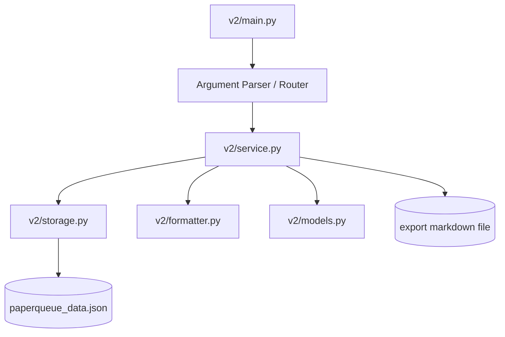
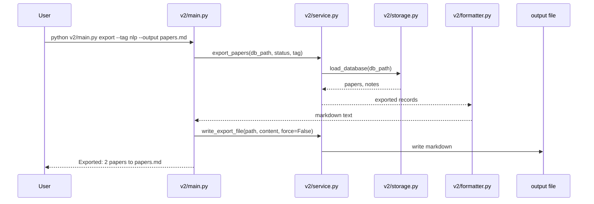

# PaperQueue CLI v2.0 SDD

本文件為 `PaperQueue CLI` 的 v2.0 Spec-Driven Development Document。v2.0 以 v1.0 的 CLI 契約為基線，在不破壞既有指令、輸出格式與退出碼的前提下，擴充筆記管理、推薦篩選、增量標籤管理與資料匯出功能。

## 1. 專案概覽

- 專案名稱：PaperQueue CLI
- 版本：v2.0
- 核心定位：一個以命令列管理論文收藏、閱讀狀態、筆記與待讀排序的本地工具
- v2.0 目標：
  - 完整保留 v1.0 的公開 CLI 契約
  - 補上筆記回顧與刪除能力
  - 讓 `next` 支援臨時篩選
  - 新增 `tag` 指令處理增量標籤管理
  - 新增 `export` 指令輸出可分享的 Markdown 文字

## 2. 向下相容性設計（Backward Compatibility）

### 2.1 保留的 v1.0 介面

| v1.0 指令 | v2.0 行為 | 是否相容 |
|---|---|---|
| `add` | 行為與輸出不變 | ✅ 完全相容 |
| `list` | 行為與輸出不變 | ✅ 完全相容 |
| `show` | 行為與輸出不變 | ✅ 完全相容 |
| `update` | 行為與輸出不變；`update --tags` 仍為完整覆蓋 | ✅ 完全相容 |
| `note --id INT --text TEXT` | 保留原新增筆記模式 | ✅ 完全相容 |
| `next` | 未提供新旗標時，排序與輸出不變 | ✅ 完全相容 |
| `delete` | 行為與輸出不變 | ✅ 完全相容 |
| `stats` | 行為與輸出不變 | ✅ 完全相容 |

### 2.2 Breaking Changes

本版本無 Breaking Changes。

### 2.3 遷移策略

- 本次 v2.0 不涉及資料格式遷移
- 仍沿用 v1.0 的 JSON 儲存結構
- 因為 PRD 沒有要求更換儲存層，保留 JSON 可以將架構差異壓到最小

## 3. CLI 介面規格

### 3.1 命令格式總覽

```text
python v2/main.py [--db PATH] <command> [command options]
```

### 3.2 全域規則

- `--db PATH`：
  - 型別：`str`
  - 必填：否
  - 預設值：`./paperqueue_data.json`
- 成功訊息輸出至 `stdout`
- 錯誤訊息輸出至 `stderr`
- 所有 ID 皆為正整數且由系統自動遞增
- `status` 允許值仍為：`unread`、`reading`、`read`
- `priority` 允許值仍為：`1` 到 `5`
- `authors` 仍以分號分隔輸入
- `tags` 仍以逗號分隔輸入

### 3.3 沿用 v1.0 的指令

以下指令在 v2.0 中完全沿用 v1.0 契約：

- `add`
- `list`
- `show`
- `update`
- `delete`
- `stats`

其輸出格式、欄位順序、錯誤碼與 v1.0 定義完全相同。

### 3.4 `note`：新增 / 列出 / 刪除筆記

#### 3.4.1 新增筆記（保留 v1 語意）

```text
python v2/main.py [--db PATH] note --id INT --text TEXT
```

成功輸出：

```text
Added note: [<paper_id>]
```

#### 3.4.2 列出指定論文的所有筆記

```text
python v2/main.py [--db PATH] note --id INT --list
```

行為規格：

- 列出該論文底下所有筆記
- 依 `created_at` 由早到晚排序；若時間相同，以 `note.id` 由小到大
- 每則筆記輸出格式為：

```text
[<note_id>] <created_at> | <text>
```

- 若該論文沒有筆記，輸出：

```text
No notes found for paper: <paper_id>
```

#### 3.4.3 刪除指定筆記

```text
python v2/main.py [--db PATH] note --delete-note INT
```

行為規格：

- 依 `note_id` 刪除單一筆記
- 刪除成功後，對應論文的 `updated_at` 需同步更新
- 成功輸出：

```text
Deleted note: [<note_id>]
```

### 3.5 `next`：新增臨時篩選

```text
python v2/main.py [--db PATH] next [--tag TAG] [--year-min YEAR]
```

| 參數 | 型別 | 必填 | 說明 |
|---|---|---|---|
| `--tag` | `str` | 否 | 候選論文必須包含指定 tag |
| `--year-min` | `int` | 否 | 候選論文年份必須大於等於指定值 |

行為規格：

- 先從 `status` 為 `unread` 或 `reading` 的論文中挑候選
- 若提供 `--tag`，只保留包含該 tag 的候選
- 若提供 `--year-min`，只保留 `year >= year_min` 且 `year` 不為空的候選
- 最後仍依 v1.0 的固定排序規則選出第一名：
  1. `priority` 高者優先
  2. `reading` 優先於 `unread`
  3. `year` 較新者優先，缺失年份排最後
  4. `id` 較小者優先
- 若未提供任何新旗標，行為與 v1.0 完全相同
- 若無候選論文，輸出：

```text
No candidate papers found.
```

### 3.6 `tag`：增量標籤管理

#### 3.6.1 新增標籤

```text
python v2/main.py [--db PATH] tag --id INT --add TAGS
```

行為規格：

- 將 `TAGS` 中的標籤追加到既有標籤清單尾端
- 已存在的標籤自動忽略，不重複追加
- 保留既有標籤順序不變
- 若有任何實際變更，更新 `updated_at`

成功輸出：

```text
Tags: <tag1,tag2,...>
```

#### 3.6.2 移除標籤

```text
python v2/main.py [--db PATH] tag --id INT --remove TAGS
```

行為規格：

- 從指定論文的 tags 中移除 `TAGS` 所列標籤
- 若指定移除的標籤不存在，不視為錯誤，但需提示
- 若有任何實際移除，更新 `updated_at`

輸出格式：

- 若有不存在標籤：

```text
Missing tags: <tag1,tag2,...>
Tags: <current_tags_or->
```

- 若全部移除成功：

```text
Tags: <current_tags_or->
```

### 3.7 `export`：匯出論文資料

```text
python v2/main.py [--db PATH] export [--status STATUS] [--tag TAG] [--output PATH] [--force]
```

| 參數 | 型別 | 必填 | 說明 |
|---|---|---|---|
| `--status` | `str` | 否 | 只匯出指定狀態的論文 |
| `--tag` | `str` | 否 | 只匯出包含指定 tag 的論文 |
| `--output` | `str` | 否 | 將匯出內容寫入指定檔案 |
| `--force` | `flag` | 否 | 允許覆蓋既有輸出檔 |

行為規格：

- 匯出格式採 Markdown
- 若未提供 `--output`，直接輸出到 `stdout`
- 若提供 `--output`：
  - 預設不得覆蓋既有檔案
  - 只有搭配 `--force` 時才允許覆蓋
- 匯出資料包含：
  - 標題
  - 作者
  - 年份
  - 發表來源
  - 狀態
  - 標籤
  - 連結
  - 所有筆記內容

輸出範例：

```text
# PaperQueue Export

## [1] Paper Title
- Authors: Alice; Bob
- Year: 2024
- Venue: AIASE
- Status: unread
- Tags: ai, nlp
- URL: https://example.org
- Notes:
  - [1] 2026-03-26T21:15:59 | sample note
```

寫入檔案成功時輸出：

```text
Exported: <count> papers to <path>
```

## 4. 資料模型

v2.0 沿用 v1.0 的資料模型，不新增或刪除資料欄位。

### 4.1 `Paper`

| 欄位 | 型別 | 說明 |
|---|---|---|
| `id` | `int` | 論文唯一識別碼 |
| `title` | `str` | 論文標題 |
| `authors` | `list[str]` | 作者清單 |
| `year` | `int \| null` | 發表年份 |
| `venue` | `str \| null` | 會議或期刊 |
| `tags` | `list[str]` | 標籤清單 |
| `url` | `str \| null` | 線上連結 |
| `pdf_path` | `str \| null` | 本地 PDF 路徑 |
| `status` | `str` | `unread` / `reading` / `read` |
| `priority` | `int` | 閱讀優先級 |
| `created_at` | `str` | 建立時間 |
| `updated_at` | `str` | 最近更新時間 |

### 4.2 `Note`

| 欄位 | 型別 | 說明 |
|---|---|---|
| `id` | `int` | 筆記唯一識別碼 |
| `paper_id` | `int` | 對應的論文 ID |
| `text` | `str` | 筆記內容 |
| `created_at` | `str` | 建立時間 |

### 4.3 資料一致性規則

- `next_paper_id` 與 `next_note_id` 需始終大於目前最大 ID
- `notes.paper_id` 應指向存在中的 `papers.id`
- 刪除論文時，關聯筆記需同步刪除
- 刪除單一筆記時，論文本身保留，但 `notes` 計數需同步反映在 `show`

## 5. 模組架構

### 5.1 實際模組拆分

| 模組 | 主要責任 |
|---|---|
| `v2/main.py` | CLI entry point、參數解析、dispatch |
| `v2/service.py` | 核心邏輯、驗證、v2 新功能實作 |
| `v2/storage.py` | JSON 載入與寫回 |
| `v2/models.py` | 資料類別、共享常數與錯誤類型 |
| `v2/formatter.py` | 所有 stdout 格式化 |
| `v2/requirements.txt` | 相依套件清單，本版無第三方依賴 |

### 5.2 架構圖



### 5.3 `export` 指令流程圖



### 5.4 設計原則

- 保留 v1 的模組切分，只在既有模組上加功能
- 不把新功能硬塞到 `show` 或 `update`，而是以新旗標或新指令擴充
- 所有輸出格式都集中在 `formatter.py`，避免 v2 修改時破壞舊輸出
- `tag` 與 `update --tags` 並存：
  - `update --tags` 負責完整覆蓋
  - `tag` 負責增量增刪

## 6. 錯誤處理規格

| 情境 | 預期行為 | 退出碼 |
|---|---|---|
| 找不到指定論文 ID | `Error: paper not found: <id>` | `1` |
| 找不到指定筆記 ID | `Error: note not found: <id>` | `1` |
| `update` 未提供任何可更新欄位 | `Error: no fields to update` | `2` |
| `status` 非法 | `Error: invalid status: <value>` | `2` |
| `priority` 非法 | `Error: invalid priority: <value>` | `2` |
| `note --list` 未提供 `--id` | `Error: note list requires --id` | `2` |
| `note` 新增模式未提供 `--id` | `Error: note add requires --id` | `2` |
| `note --delete-note` 同時提供 `--id` | `Error: note delete does not accept --id` | `2` |
| `tag --add` 或 `tag --remove` 給空 tags | `Error: tags must not be empty` | `2` |
| `export --output` 指向既有檔案且未加 `--force` | `Error: output file already exists: <path>` | `2` |
| 匯出檔案寫入失敗 | `Error: failed to write export file` | `3` |
| JSON 讀取失敗 | `Error: failed to read database` | `3` |
| JSON 寫入失敗 | `Error: failed to write database` | `3` |

## 7. 測試案例

### 7.1 v1 回歸測試

v1.0 在 `sdd_v1.md` 中定義的 9 個 sequential test cases，必須全部能以 `python v2/main.py` 重新通過。

### 7.2 v2 新功能測試

以下案例以同一工作目錄依序執行，資料檔使用 `./tmp_sdd_v2_demo.json`。

| # | 輸入指令 | 預期輸出 |
|---|---|---|
| 1 | `python v2/main.py --db ./tmp_sdd_v2_demo.json add --title "Paper A" --authors "Alice" --year 2024 --venue "ConfA" --tags "ai,nlp" --priority 5` | `Added: [1] Paper A` |
| 2 | `python v2/main.py --db ./tmp_sdd_v2_demo.json note --id 1 --text "first note"` | `Added note: [1]` |
| 3 | `python v2/main.py --db ./tmp_sdd_v2_demo.json note --id 1 --list` | `[1] <created_at> | first note` |
| 4 | `python v2/main.py --db ./tmp_sdd_v2_demo.json note --delete-note 1` | `Deleted note: [1]` |
| 5 | `python v2/main.py --db ./tmp_sdd_v2_demo.json tag --id 1 --add rag,nlp` | `Tags: ai,nlp,rag` |
| 6 | `python v2/main.py --db ./tmp_sdd_v2_demo.json tag --id 1 --remove missing,rag` | `Missing tags: missing` + 下一行 `Tags: ai,nlp` |
| 7 | `python v2/main.py --db ./tmp_sdd_v2_demo.json next --tag nlp --year-min 2024` | `Next: [1] Paper A` |
| 8 | `python v2/main.py --db ./tmp_sdd_v2_demo.json export --tag nlp` | 以 `# PaperQueue Export` 開頭，且包含 `## [1] Paper A` |
| 9 | `python v2/main.py --db ./tmp_sdd_v2_demo.json export --output ./tmp_export.md` | `Exported: <count> papers to ./tmp_export.md` |
| 10 | 再次執行上一條且不加 `--force` | `Error: output file already exists: ./tmp_export.md`，退出碼 `2` |

## 8. 非目標

以下功能仍不屬於 v2.0 範圍：

- 不整合外部學術 API
- 不解析 PDF 全文
- 不提供 GUI 或 Web UI
- 不支援雲端同步
- 不提供全文搜尋
