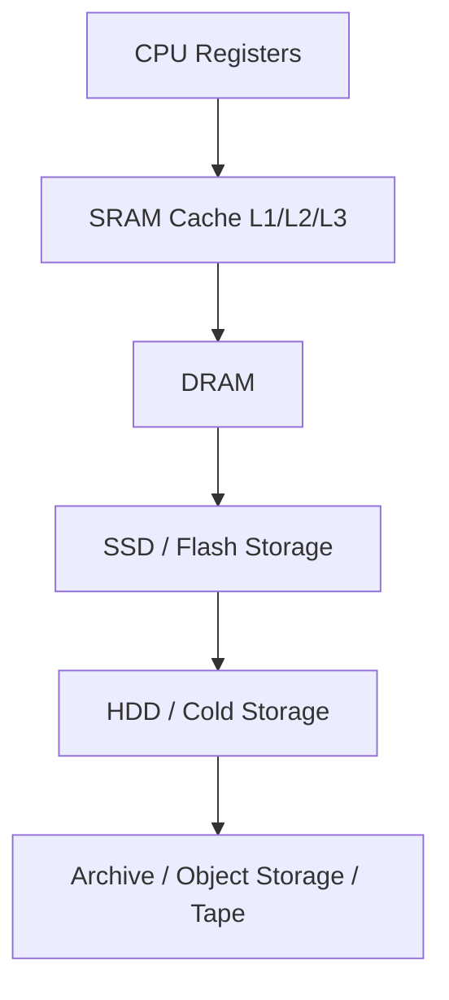
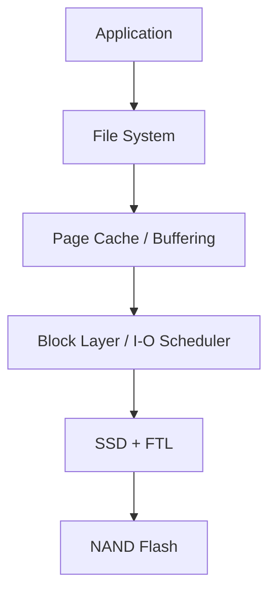
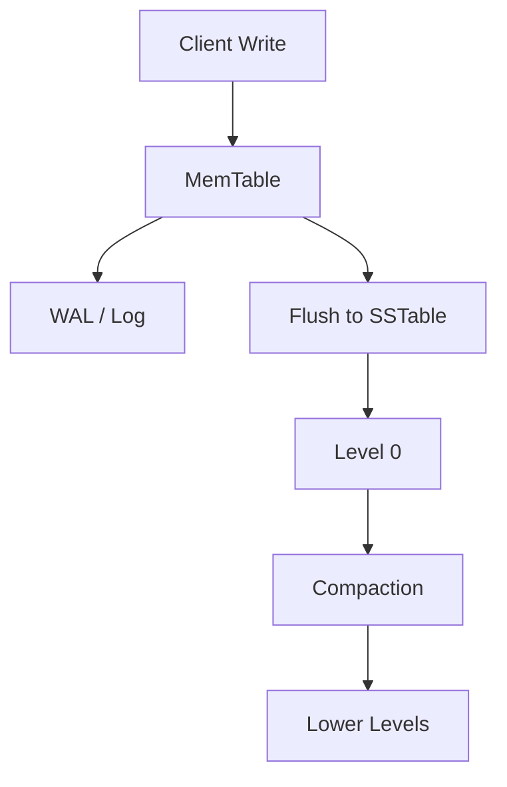
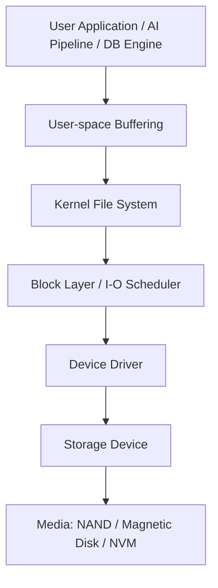
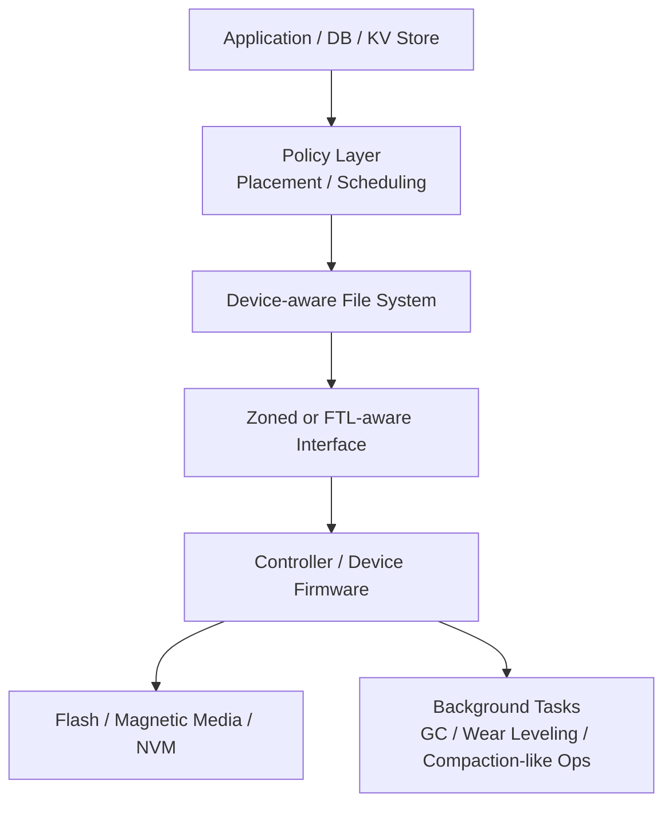

# 從系統研究到新興儲存裝置：一篇給未來研究生的技術導覽

## 從設計取捨、儲存階層、SSD/FTL 到 NVM 與硬體軟體協同設計

> 作者：Edison Lin（林冠宇）  
> 類型：技術教學介紹  
> 主題：系統研究導論與新興儲存裝置  
> 更新日期：2026-03

---

## ✨ 前言：為什麼我要寫這篇？

在學習 AI、作業系統、資料庫或系統架構的過程中，我慢慢發現一件事：

> 很多效能瓶頸，並不是演算法本身不夠好，而是整個系統設計沒有對齊硬體特性。

例如你可能會看到這些情況：

- GPU 很強，但訓練速度不如預期（資料載入卡住）
- SSD 明明很快，但系統延遲還是抖動很大（GC / tail latency）
- 資料庫吞吐量不穩（index 結構與儲存裝置特性不匹配）
- 單一元件升級了，但整體效能沒明顯提升（系統瓶頸在別處）

這也是我開始對 **系統研究（System Research）** 和 **新興儲存裝置（Emerging Storage Systems）** 產生興趣的原因。

這篇文章會用比較「教學介紹部落格」的方式，從大方向一路走到技術細節，幫助讀者建立一個完整的系統觀點。

---

## 📚 本文你會學到什麼？

這篇文章會涵蓋以下主題：

- Introduction to System Research（系統研究導論）
- System Tradeoffs and Design Space（系統設計取捨與設計空間）
- Data Storage Systems and Memory Hierarchy（資料儲存系統與記憶體階層）
- Flash Memory, SSD, and FTL（Flash、SSD 與 FTL）
- Magnetic Disk: From History to Modern Variants（磁碟從歷史到現代變體）
- NVM 概觀：PCM、STT-RAM、Skyrmion、RRAM
- Software Layer and Its Importance（檔案系統與 Flash 互動）
- Index Structures（Tree / Hashing / LSM-tree / Key-Value Store）
- System Architecture Diagrams（設計原則與關鍵元件）
- Hardware-Software Co-Design & Future Computing Paradigms（未來計算典範）

---

## 🧭 建議閱讀方式

- **初學者**：先看第 1～5 節建立全貌
- **有 OS / DB 基礎者**：重點看第 6～10 節
- **想往研究所方向規劃**：請看第 11～12 節與結論

---

# 1. Introduction to System Research（什麼是系統研究？）

## 1.1 系統研究不是只在「寫作業系統」

很多人聽到「系統研究」會先想到：

- 作業系統核心（Kernel）
- 排程器（Scheduler）
- 記憶體管理（Memory Management）

這些當然都屬於系統研究，但實際上系統研究的範圍更大，常見包含：

- 作業系統（OS）
- 檔案系統（File Systems）
- 儲存系統（Storage Systems）
- 資料庫系統（Database Systems）
- 分散式系統（Distributed Systems）
- 網路系統（Networking Systems）
- 虛擬化 / 容器 / 雲端基礎設施
- 系統安全、可觀測性、可靠性工程

### 一句話版本

> **系統研究的核心，是設計能在真實世界限制下有效運作的計算基礎架構。**

---

## 1.2 系統研究在做什麼？

系統研究通常會問這種問題：

- 如何讓程式跑得更快？
- 如何讓延遲更穩定（P99 更好）？
- 如何降低硬體成本或能耗？
- 如何在故障時保持可靠？
- 如何讓軟體更理解硬體特性？
- 如何讓設計在不同 workload 下仍有好表現？

這類問題通常沒有單一正解，而是牽涉大量 **trade-off（取捨）**。

---

## 1.3 為什麼系統研究很重要？

因為它常常決定了「上層應用能跑到多好」。

例如：

- AI 模型效能上限常被 I/O 與資料管線限制
- 資料庫吞吐量受索引結構與儲存設計影響
- 雲端服務穩定度受排程、隔離、儲存延遲影響

> 換句話說，系統研究是在處理「整體效能與可用性」的底層條件。

---

# 2. System Tradeoffs and Design Space（系統取捨與設計空間）

## 2.1 什麼是設計空間（Design Space）？

當我們設計一個系統時，通常不是只有一種方法，而是一整片可能方案的空間。這片空間會受到：

- 硬體能力
- 成本限制
- 工作負載型態
- 開發複雜度
- 可維護性
- 相容性

影響。

這就是常說的 **design space（設計空間）**。

---

## 2.2 系統設計常見 Trade-offs

### (A) 效能 vs 成本

- 用更高階硬體通常可提升效能
- 但成本可能高很多，不一定符合部署需求

### (B) 吞吐量 vs 延遲

- 某些 batch 化設計可以提高 throughput
- 但可能增加單次請求延遲

### (C) 平均效能 vs 尾延遲（Tail Latency）

- 平均值看起來很好
- 但 P99 / P99.9 很差會影響實際使用體驗

### (D) 通用性 vs 特化最佳化

- 通用方案比較好部署、好維護
- 特化方案（針對 workload）效能可能更好

### (E) 抽象化 vs 可控性

- 抽象化讓開發更簡單
- 但也可能隱藏硬體細節，讓最佳化變困難

---

## 2.3 一個簡單例子：快取策略不是越大越好

你可能直覺覺得：「快取越大越好」。

但實際上還要考慮：

- hit rate 是否真的提升？
- cache eviction 成本
- metadata 管理成本
- 一致性與同步成本
- tail latency 影響

這就是系統研究的典型思路：**不是只問某個參數變大會不會更快，而是問整體系統如何平衡。**

---

## 2.4 系統設計思考框架（實用）

在看一個系統設計時，我現在會試著問以下問題：

- 目標 workload 是什麼？
- 優化目標是 throughput、latency、cost 還是 reliability？
- 底層硬體有什麼限制？
- 哪些複雜度放在硬體？哪些放在軟體？
- 如果 workload 改變，設計還有效嗎？

### ✅ 小提醒（研究與實作都適用）

- [x] 先定義目標
- [x] 再選設計
- [x] 最後才調參數

---

# 3. Data Storage Systems and Memory Hierarchy（資料儲存系統與記憶體階層）

## 3.1 為什麼需要 Memory Hierarchy？

不同儲存媒介有不同特性：

- 有些很快但很貴（如 SRAM）
- 有些容量大但很慢（如 HDD）
- 有些速度與成本居中（如 SSD / DRAM）

因此電腦系統會形成一個階層式設計（hierarchy），在速度、容量、成本之間做平衡。

---

## 3.2 記憶體／儲存階層（概念圖）



### 一般趨勢（概念）

- 往上：速度快、延遲低、容量小、成本高
- 往下：速度慢、延遲高、容量大、成本低

---

## 3.3 儲存系統在整體架構中的角色

儲存系統不只是最後一層「放資料的地方」，而是會影響：

- application startup time
- query latency
- checkpoint frequency
- logging throughput
- data pipeline efficiency

在 AI / Data 系統中更明顯，因為資料搬移成本很常成為瓶頸。

---

## 3.4 兩種常見誤解

### ❌ 誤解 1：有 SSD 就不需要在意 I/O

錯。SSD 雖然快，但 I/O pattern、queue depth、GC、檔案系統設計仍然會大幅影響效能。

### ❌ 誤解 2：記憶體階層只和硬體有關

錯。軟體（OS、檔案系統、DB、runtime）的設計會直接影響資料如何在階層中移動。

---

# 4. Flash Memory, SSD, and FTL（Flash、SSD 與 FTL）

## 4.1 Flash Memory 基本概念

SSD 的核心儲存介質通常是 **NAND Flash**。Flash 與 DRAM 最大差異之一是：

- DRAM：易失性（斷電資料消失）
- Flash：非揮發性（斷電資料仍保留）

但 Flash 有幾個重要限制：

- 寫入與擦除粒度不同（page / block）
- 無法像 RAM 那樣直接覆寫
- 擦寫次數有限（endurance 限制）
- 垃圾回收（GC）會影響效能穩定度

---

## 4.2 SSD 為什麼複雜？因為有 FTL

FTL（Flash Translation Layer）是 SSD 很核心的一層，負責把主機看到的邏輯位址（LBA）對應到實際 Flash 實體位置。

它通常還會負責（或參與）：

- address mapping
- garbage collection
- wear leveling
- bad block management
- over-provisioning 利用

---

## 4.3 FTL 可以想像成什麼？

你可以把 FTL 想像成：

> 一個在 SSD 裡面幫你管理「資料該放哪裡、什麼時候搬家、怎麼延長壽命」的翻譯與調度系統。

這也是為什麼 SSD 常被說不是單純硬體，而是「硬體 + 韌體 + 演算法」的整合系統。

---

## 4.4 為什麼會有 Write Amplification（WA）？

因為當資料更新時，SSD 可能不能直接原地覆寫，只能：

1. 寫到新位置
2. 更新映射
3. 舊資料標記無效
4. 之後 GC 再搬移/整理有效資料

於是實體寫入量可能大於邏輯寫入量。

$$
WA = \frac{\text{Physical Writes}}{\text{Logical Writes}}
$$

### WA 太高可能代表

- GC 負擔大
- 工作負載與 FTL 策略不匹配
- 空間壓力高
- 寫入模式碎片化嚴重

---

## 4.5 SSD 效能不能只看「順序讀寫 MB/s」？

不能。實務上常常更該看：

- 隨機讀寫表現（尤其小 I/O）
- queue depth 效果
- tail latency（P99）
- mixed workload 表現
- 長時間寫入穩定度（steady-state）

---

## 4.6 SSD 與軟體層的互動為什麼重要？

即使 SSD 很強，如果上層軟體：

- 產生大量不必要小寫入
- 寫入模式與 GC 衝突
- metadata 更新過度頻繁
- 缺乏 lifecycle-aware 資料放置策略

還是會造成效能與壽命問題。

> **重點：儲存效能不是只有裝置規格，而是整體系統互動結果。**

---

# 5. Magnetic Disk：From History to Modern Variants（磁碟：從歷史到現代變體）

## 5.1 為什麼現在還要學磁碟？

很多人會想：「都 SSD 時代了，還要看磁碟嗎？」

答案是：**要**。原因包括：

- HDD 在大容量與低成本場景仍很重要
- 資料中心冷資料／備份仍大量使用磁碟
- 很多新技術（如高密度磁記錄）仍持續演進
- 學磁碟可以幫助理解「介質限制如何塑造系統設計」

---

## 5.2 歷史視角：從容量導向到密度與管理導向

磁碟技術發展很大一部分驅動力來自：

- 更高面積密度
- 降低成本/GB
- 維持可接受效能
- 與既有軟體生態相容

這也讓磁記錄技術從傳統設計逐步發展出不同變體。

---

## 5.3 現代變體（概念導覽）

### (A) 傳統磁記錄（基礎概念）

- 成熟、穩定
- 管理方式相對直觀
- 但密度提升空間有限

### (B) SMR（Shingled Magnetic Recording）

- 以部分重疊磁軌提升密度
- 類似屋瓦排列
- 寫入管理更複雜，某些情境需順序化處理

### (C) IMR（Interlaced Magnetic Recording）

- 強調更進一步的磁軌安排與設計策略（概念層級）
- 目標通常是在密度與效能限制間找新平衡
- 可能需要更聰明的 host/software 管理

---

## 5.4 為什麼現代磁碟變體值得研究？

因為它們會迫使我們重新思考：

- 檔案系統是否應該了解裝置限制？
- 資料放置策略如何設計？
- metadata 與 data 是否該分開佈局？
- random write workload 如何降低成本？

這些問題和你之後學的檔案系統、儲存系統研究高度相關。

---

# 6. Overview of Non-Volatile Memory（NVM 概觀）

## 6.1 NVM 是什麼？為什麼大家一直提？

NVM（Non-Volatile Memory）指的是一類「斷電後資料仍存在」的記憶體技術。它吸引人的地方在於：

- 可能比傳統儲存更低延遲
- 某些技術有更高耐久度潛力
- 有機會改變記憶體與儲存之間的界線

> 注意：NVM 是一個大範疇，不同技術差異很大，成熟度也不同。

---

## 6.2 NVM 的系統研究價值

即使某些技術尚未大規模普及，NVM 在研究上的價值仍然很高，因為它讓我們思考：

- 如果存取延遲更低，OS / FS / DB 該怎麼改？
- 資料結構是否應該重新設計？
- crash consistency 要怎麼處理？
- 是否還需要傳統 block I/O 抽象？

---

## 6.3 常見 NVM 技術簡介（導覽版）

### 6.3.1 PCM（Phase-Change Memory）

PCM 利用材料相變化來表示不同狀態，常被視為具潛力的非揮發性記憶體技術之一。

可能關注點：

- 速度與耐久度特性（相對於其他技術）
- 寫入成本與熱效應
- 系統整合方式

---

### 6.3.2 STT-RAM（Spin-Transfer Torque RAM）

STT-RAM 屬於磁性記憶體方向，常見優點討論包含：

- 非揮發性
- 潛在高速
- 良好耐久度潛力

研究上常會討論：

- 容量與成本限制
- 寫入能耗
- 在 cache / memory hierarchy 中的定位

---

### 6.3.3 Skyrmion（Skyrmion-based Memory，概念性前沿方向）

Skyrmion 常出現在較前沿/新型磁性記憶體研究中，屬於偏研究探索性質的主題。

這類技術對系統研究者的意義不一定是立刻可部署，而是：

- 提供新的硬體能力假設
- 迫使我們思考未來軟硬體介面怎麼設計

> 這類主題很適合當「未來計算典範」或「前瞻技術」的延伸閱讀。

---

### 6.3.4 RRAM（Resistive RAM）

RRAM（電阻式記憶體）也是常見 NVM 候選技術之一，透過電阻狀態改變儲存資訊。

研究與工程上常關注：

- 製程與穩定性
- 寫入一致性
- 大規模整合可能性
- 作為記憶體/儲存中間層的定位

---

## 6.4 NVM 導覽比較表（概念層級）

| 技術     | 類型印象     | 潛在優勢               | 常見挑戰（概念）     | 研究價值 |
| -------- | ------------ | ---------------------- | -------------------- | -------- |
| PCM      | 相變化記憶體 | 非揮發、潛在低延遲     | 寫入成本、整合複雜度 | 高       |
| STT-RAM  | 磁性記憶體   | 潛在高速、耐久度佳     | 成本、容量、能耗     | 高       |
| Skyrmion | 前沿磁性方向 | 新穎物理機制與密度潛力 | 成熟度、實作難度     | 前瞻探索 |
| RRAM     | 電阻式記憶體 | 結構潛力高、非揮發     | 穩定性、製程、一致性 | 高       |

> ⚠️ 這裡是教學導覽版，不是商用規格比較表。

---

# 7. Software Layer and Its Importance（軟體層的重要性：File Systems 與 Flash 互動）

## 7.1 為什麼軟體層重要到可以決定硬體表現？

因為同一顆儲存裝置，在不同軟體設計下可能表現差很多。影響來源包括：

- 檔案系統寫入模式
- metadata 更新頻率
- sync / fsync 策略
- log 設計
- buffer cache 策略
- block allocation policy

---

## 7.2 檔案系統不是「只是存檔 API」

檔案系統（File System）處理的不只是 `open/read/write/close`，它實際上在做很多事：

- 命名空間管理（directories, filenames）
- 空間配置（block allocation）
- metadata 維護（inode, timestamps, permissions）
- crash consistency（journaling / copy-on-write 等）
- 效能優化（layout / batching / caching）

---

## 7.3 Flash 與 File System 互動常見問題

當檔案系統設計沒有考慮 Flash 特性時，可能出現：

- 過多小寫入 → 放大 FTL 負擔
- metadata 與 data 混雜 → GC 干擾
- update pattern 不佳 → WA 增加
- sync 太頻繁 → tail latency 上升

### 一個直覺例子

如果應用程式一直做大量小更新，而檔案系統每次都立刻同步，SSD 內部可能會很忙於搬移與回收，導致延遲波動變大。

---

## 7.4 為什麼「File-system-aware / Device-aware」是重要方向？

因為未來裝置特性越來越多樣（如 zoned storage、不同 NAND 世代、高密度磁記錄），單靠傳統抽象層可能不夠。

值得研究的方向包括：

- 根據資料生命周期做佈局
- 將 metadata / data 分層放置
- 針對裝置限制設計 allocation policy
- 與裝置回收機制協調（降低干擾）

---

## 7.5 一個簡化互動示意圖



> 你看到的 latency，通常是這整條路徑共同作用的結果。

---

# 8. Index Structures（索引結構：Trees / Hashing / LSM-tree / Key-Value Stores）

## 8.1 為什麼索引結構和儲存系統有關？

很多人把「資料結構」和「儲存系統」分開學，但在資料庫 / Key-Value Store 裡，它們其實是綁在一起的：

- 索引結構決定讀寫 pattern
- 讀寫 pattern 影響儲存裝置表現
- 儲存特性又反過來影響索引結構選擇

> 也就是說：**Index design = data structure + storage behavior + workload assumption**

---

## 8.2 Trees（樹狀結構，如 B-tree 家族）

### 基本想法

用樹狀結構維護排序與查詢效率，支援：

- point lookup
- range query
- ordered traversal

### 優點

- 範圍查詢強
- 排序資料處理方便
- 在資料庫系統中非常經典

### 挑戰

- 更新與節點分裂/合併成本
- 寫入 pattern 可能較分散
- 在某些儲存介質上可能產生較多隨機寫入

---

## 8.3 Hashing（雜湊）

### 基本想法

透過 hash function 將 key 映射到特定位置，常見於：

- point lookup
- key-value indexing
- 快速存在性查詢（配合其他結構）

### 優點

- 點查詢快（平均情況）
- 結構直觀
- 常見於 cache / index / hash table 設計

### 限制

- 範圍查詢不擅長
- rehash 成本可能高
- 碰撞處理影響效能

---

## 8.4 LSM-tree（Log-Structured Merge-tree）

LSM-tree 是現代儲存系統與資料庫中很重要的一類設計，特別常見於寫入密集型場景與 key-value stores。

### 核心概念（簡化）

- 先把寫入收集在記憶體（如 memtable）
- 再批次 flush 到磁碟（形成 SSTable 等）
- 背景做 compaction / merge

### 為什麼受歡迎？

- 對寫入友善（batch / sequential-ish）
- 適合大量插入更新場景
- 很適合現代 storage stack 中某些 workload

### 但也有代價

- compaction 會帶來背景 I/O 成本
- read amplification / write amplification / space amplification 的平衡很重要
- tail latency 可能受 compaction 干擾

---

## 8.5 Key-Value Stores（鍵值儲存系統）

Key-Value Store 是很常見的系統元件形式，從嵌入式到大型分散式系統都會出現。

常見設計問題包含：

- key lookup latency
- compaction policy
- cache strategy
- persistence / recovery
- index structure 選型（B-tree-like vs LSM-like）
- 與底層 storage 特性的匹配

---

## 8.6 索引結構比較（教學版）

| 結構               | 擅長               | 潛在弱點                | 與儲存系統關聯重點                   |
| ------------------ | ------------------ | ----------------------- | ------------------------------------ |
| Trees（如 B-tree） | 範圍查詢、排序資料 | 更新成本與 layout 複雜  | 隨機 I/O、頁面佈局、節點更新         |
| Hashing            | 點查詢             | 不擅長範圍查詢          | lookup latency、碰撞、rehash         |
| LSM-tree           | 高寫入吞吐         | compaction 成本、讀放大 | sequential write、background I/O、WA |
| KV Store（系統層） | 依實作而定         | 設計空間大、取捨多      | index+cache+storage 協同設計         |

---

## 8.7 一個簡化的 LSM 寫入流程示意



---

# 9. System Architecture Diagrams（系統架構圖：設計原則與關鍵元件）

## 9.1 為什麼要畫架構圖？

畫架構圖的價值不只是好看，而是幫助你回答：

- 資料從哪裡來、到哪裡去？
- 哪些模組負責什麼？
- 瓶頸可能在哪？
- 哪些層之間有耦合關係？
- 哪裡適合做最佳化或實驗插入點？

對寫技術文章、做研究 proposal、設計實驗都很有幫助。

---

## 9.2 系統架構圖的設計原則（教學版）

### 原則 1：先畫資料流，再補控制流

先回答「資料怎麼走」，通常比較容易。

### 原則 2：先畫關鍵元件，不要一開始畫太細

例如先畫：

- Application
- File System / DB
- Buffer/Cache
- I/O Layer
- Device

之後再細化。

### 原則 3：畫出邊界（Boundary）

例如：

- User space / Kernel space
- Host / Device
- Fast path / Background path

### 原則 4：標出你要討論的 bottleneck

架構圖不是全知圖，應該為你的主題服務。

---

## 9.3 範例：一般資料密集型系統的儲存路徑（簡化）



---

## 9.4 範例：加入裝置特性感知（Device-aware）的設計概念圖



> 這類架構圖的重點是讓讀者看到：**真正的效能與穩定度，來自多層決策的交互作用。**

---

## 9.5 研究導向畫圖小技巧

- 用顏色區分（如果之後轉 HTML/CSS 可美化）
- 用虛線框出「未來研究插入點」
- 把背景任務（GC / compaction）獨立畫出來
- 在圖旁邊附上假設（assumptions）

---

# 10. Hardware-Software Co-Design & Future Computing Paradigms（硬體軟體協同設計與未來計算典範）

## 10.1 為什麼要談 Hardware-Software Co-Design？

傳統做法常常是：

- 硬體先設計好
- 軟體再去適配它

但在很多高效能或資料密集型場景中，這樣會浪費很多潛力。因為：

- 硬體知道的資訊沒有效暴露給軟體
- 軟體不了解硬體限制，做出不理想操作
- 雙方各自最佳化，但整體不一定最佳

所以近年很重要的方向是：

> **Hardware-Software Co-Design（軟硬體協同設計）**

也就是讓硬體能力、介面設計、軟體策略一起被考慮。

---

## 10.2 在儲存系統中的 Co-Design 例子（概念）

### 例子 1：Zoned Storage

- 硬體/介面暴露 zone 規則
- 軟體（FS / DB）根據規則設計寫入策略
- 目標：降低 WA、提升 predictability

### 例子 2：Computational Storage

- 硬體提供近資料計算能力
- 軟體決定哪些任務 offload
- 目標：降低資料搬移與主機負擔

### 例子 3：NVM-aware Data Structures

- 硬體具備新延遲/持久性特性
- 軟體調整資料結構與一致性策略
- 目標：利用新介質特性，而非沿用舊抽象

---

## 10.3 Future Computing Paradigms（未來計算典範）可以怎麼理解？

這裡不一定是科幻，而是系統架構思維的轉變，例如：

- **Data-centric computing（資料中心化計算）**
  - 不再只以 CPU 為中心，而是以資料路徑與資料位置為核心設計系統

- **Near-data / In-storage computing**
  - 盡量少搬資料，讓部分處理在資料附近完成

- **Cross-layer optimization**
  - 應用、資料結構、檔案系統、裝置韌體共同設計

- **Adaptive / workload-aware systems**
  - 根據 workload 特徵動態調整策略（可能結合 AI/ML）

---

## 10.4 我覺得最值得關注的未來方向（個人觀點）

### (A) 儲存系統與 AI 工作負載深度整合

AI 系統常常被 I/O 與資料管線卡住，未來會更需要 storage-aware AI infra。

### (B) Device-aware File Systems / KV Stores

不同裝置特性差異越來越大，上層軟體需要更聰明地對齊硬體限制。

### (C) 可觀測性與可解釋性（Observability）

沒有可觀測性就很難真正做最佳化，尤其在 tail latency 問題上。

### (D) 軟硬體協同的標準化介面

如果介面設計不好，硬體能力再強也不容易被軟體利用。

---

# 11. 一個小型系統研究思考範例（從問題到實驗）

假設我要研究一個「Flash-aware / Device-aware 的資料放置策略」，我可能會這樣思考：

## 11.1 問題定義

- 某類 workload 在 SSD 上 tail latency 不穩
- 懷疑 metadata/data 混雜造成 GC 干擾

## 11.2 假設（Hypothesis）

- 若將短生命週期資料與長生命週期資料分開放置，可能降低搬移成本與 WA

## 11.3 評估指標

- Average latency
- P99 latency
- Throughput
- Write Amplification
- GC overhead（若可觀測）

## 11.4 實驗比較組

- Baseline allocation
- Lifecycle-aware allocation
- Size-aware allocation

## 11.5 這種研究的價值

即使結果沒有全面勝出，也能幫助我們理解：

- 哪種 workload 受益？
- 哪種場景會退化？
- 系統 trade-off 在哪裡？

---

## 11.6 示意程式碼（Python，僅概念展示）

```python
from dataclasses import dataclass
from typing import List

@dataclass
class IORequest:
    op: str        # "read" or "write"
    size_kb: int
    is_metadata: bool
    lifetime_hint: str   # "short" / "long" / "unknown"

def choose_placement(req: IORequest) -> str:
    """
    示意：依資料特性選擇放置區域（概念版）
    """
    if req.is_metadata:
        return "zone_meta"
    if req.lifetime_hint == "short":
        return "zone_short_lived"
    if req.lifetime_hint == "long":
        return "zone_long_lived"
    if req.size_kb >= 128:
        return "zone_large_io"
    return "zone_default"

def summarize_placement(reqs: List[IORequest]) -> dict:
    stats = {}
    for r in reqs:
        z = choose_placement(r)
        stats[z] = stats.get(z, 0) + 1
    return stats

# TODO:
# - 加入 sequential/random pattern 判斷
# - 模擬 GC 成本與 WA 估計
# - 比較 baseline vs device-aware policy 的 tail latency
```

---

# 12. 本文重點整理（快速複習）

## ✅ 如果你只記得 10 件事，請記這些

1. 系統研究的核心是「在真實限制下做整體最佳化」
2. 設計空間（design space）比單一技巧更重要
3. 儲存系統與記憶體階層共同影響整體效能
4. SSD 很快，但 Flash 與 FTL 的限制很關鍵
5. Write Amplification（WA）是理解 SSD 行為的重要概念
6. 磁碟技術（含現代變體）仍然值得研究
7. NVM 不只是新硬體名詞，而是重新思考系統抽象的契機
8. 檔案系統與儲存裝置互動會直接影響效能與穩定度
9. 索引結構（Tree / Hash / LSM）與儲存介質特性密切相關
10. 未來趨勢是 Hardware-Software Co-Design 與資料中心化系統設計

---

# 13. 後續學習路線建議（給想走研究方向的人）

## 13.1 基礎打底（先建立系統感）

- [x] 作業系統基礎（程序、記憶體、檔案系統）
- [x] 儲存介質基本概念（HDD / SSD / Flash）
- [x] 效能指標（Latency / Throughput / P99）
- [x] 資料結構與索引（B-tree / Hash / LSM）

## 13.2 進階主題（開始研究導向）

- [ ] Flash-aware / Device-aware 軟體設計
- [ ] Zoned Storage / Host-managed 模型
- [ ] KV Stores 與 compaction trade-offs
- [ ] NVM-aware 資料結構與一致性設計
- [ ] Observability / tracing / profiling

## 13.3 實作能力（非常重要）

- [ ] Linux 環境與 benchmark 工具使用
- [ ] 實驗設計與結果分析
- [ ] 畫架構圖與寫技術文件
- [ ] 閱讀系統領域論文（FAST / ATC / SOSP / OSDI 等）

---

# 14. 附錄 A：名詞速查表（Glossary）

| 名詞             | 簡單說明                                                  |
| ---------------- | --------------------------------------------------------- |
| System Research  | 研究計算系統如何在真實限制下高效、穩定、可靠地運作        |
| Trade-off        | 設計取捨，例如效能與成本、延遲與吞吐量                    |
| Memory Hierarchy | 從快而貴到慢而便宜的階層式記憶體／儲存設計                |
| FTL              | Flash Translation Layer，SSD 中管理位址映射與回收的重要層 |
| GC               | Garbage Collection，回收無效資料並整理可用空間            |
| WA               | Write Amplification，實體寫入量 / 邏輯寫入量              |
| SMR / IMR        | 現代磁記錄技術方向（高密度、管理更複雜）                  |
| NVM              | 非揮發性記憶體（如 PCM、STT-RAM、RRAM 等）                |
| LSM-tree         | 以寫入友善為特徵的索引/儲存結構，常見於 KV Store          |
| Co-Design        | 軟硬體協同設計，讓介面與策略一起被優化                    |

---

# 15. 參考資料（入門導向）

1. [NVMe Organization](https://nvmexpress.org/)
2. [Linux Kernel Documentation](https://www.kernel.org/doc/html/latest/)
3. [USENIX（FAST / ATC 等系統會議）](https://www.usenix.org/)
4. [ACM Digital Library](https://dl.acm.org/)

---
